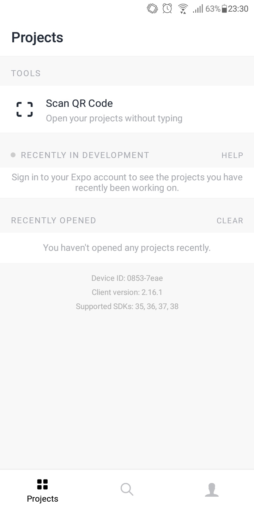
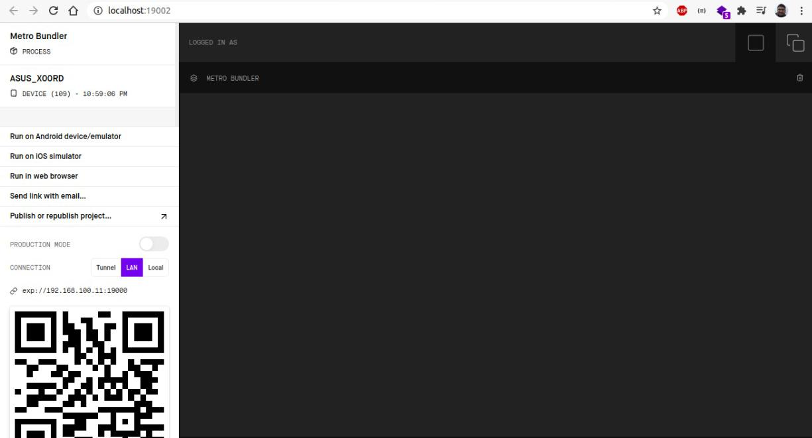
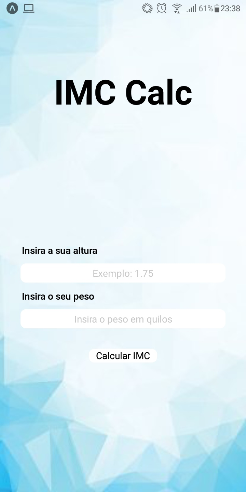

# Calculadora de IMC

# Sobre a Calculadora

O cálculo do IMC é uma excelente ferramenta para que as pessoas possam medir
se o seu peso é adequado para a sua estrutura física, podendo dessa forma
definir estratégias para uma vida saudável

# Tecnologias
- [React](https://reactjs.org/)
- [React Native](https://reactnative.dev/)
- [Expo](https://expo.io/)
- [Node](https://nodejs.org/en/)

# Instalação e uso

### Baixar aplicativo Expo

No seu dispositivo mobile baixe o aplicativo Expo

- Android

<p align="center">
  
</p>

- IOS

<p align="center">
  
</p>

### No seu computador

```bash

#Abra um terminal e insira esse comando
$ git clone https://github.com/millerraycell/curso_desenvolvimento_ifrr.git

#Insira no terminal
$ cd curso_desenvolvimento_ifrr/IMCCalc/

#Caso não tenha no seu computador baixe o programa yarn (https://classic.yarnpkg.com/en/docs/install/)
#Insira o comando para instalar as dependências do projeto (pode demorar)
$ yarn install

#Insira o comando para iniciar o app
$ yarn start
```

### No seu telefone abra o aplicativo Expo

Deverá aparecer uma tela como a indicado

<p align="center">
  
</p>

Clique em Scan QR Code

### No computador

No seu navegador irá aparecer uma página como a indicado

<p align="center">
  
</p>

Escaneie o QR Code com a câmera do seu telefone e o aplicativo irá começar no mesmo

<p align="center">
  
</p>